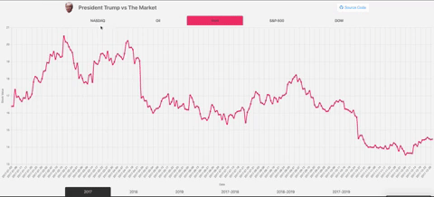

# Rendering Returns 
A correlation of President Trump's tweets and the stock market.

## Collaborators

* [Chantee Smith](https://github.com/mosaic43/)
* [Gaura Klein](https://github.com/Gauraklein)
* [Joey Killam](https://github.com/jhkillam)

## Objective
The purpose of this project was to work as a group to incorporate the following: 

* At least one JavaScript library other than jQuery
* A CSS framework
* At least two remote APIs
* Deploy to somewhere other than GitHub Pages
* Integrate with [Travis CI](https://travis-ci.org/)
* Code to be split into multiple files / modules

## APIs Used
* [Twitter](https://developer.twitter.com/en/docs)
* [Alpha Vantage](https://www.alphavantage.co/)

## CSS Framework
* [Bulma](https://bulma.io/)

## JS Libraries
* [Chart.js](https://www.chartjs.org/)
* [FullCalendar](https://fullcalendar.io/)

## Deployment
* [Netlify](https://www.netlify.com/)
